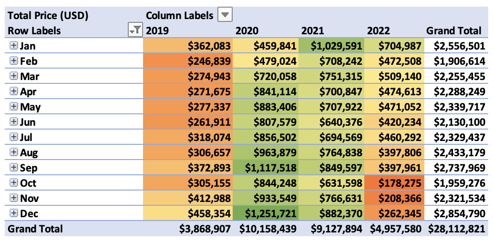
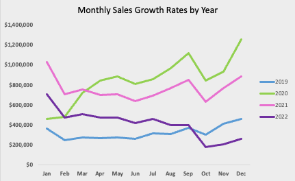
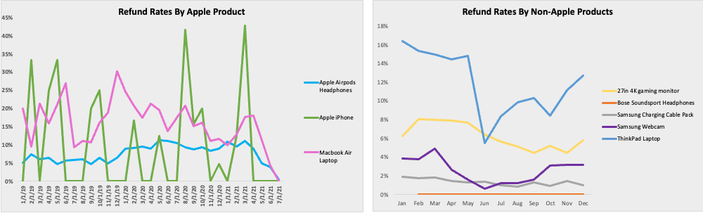
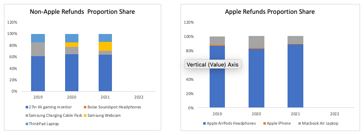

## Overview of TechTrove
Founded in 2014, TechTrove offers customers globally a wide array of high-quality advanced electronics and accessories. With extensive data on orders, customers, and geographic trends, TechTrove is well-positioned to explore this information deeply, uncovering valuable insights. These insights are crucial for pinpointing areas of improvement and developing actionable strategies to drive continuous growth in the competitive e-commerce environment.

### Digest of Discoveries

  

From 2019 to 2022, TechTrove experienced significant sales growth, surpassing $28 million USD. In 2020, the average order value (AOV) peaked at $300, marking a 163% total sales growth from 2019 to 2020, largely influenced by the COVID-19 pandemic which prompted customers to work and stay at home. However, there was a 10% decline in total orders in 2021 followed by a notable 46% drop in 2022. It is crucial for TechTrove to investigate the reasons behind these declines and strategize to maintain the sales momentum observed from 2019 to 2021. The following report presents a data-driven analysis and actionable recommendations for TechTrove to navigate successfully forward. Click [here](images/TechTrove_ERD.png) to view the entity relationship diagram.

## Insights Gleaned

### Yearly and Monthly Trends

  
  

Analysis of TechTrove's ecommerce operations from 2019 to 2022 reveals dynamic sales trends. Purchases peaked notably during holiday seasons (averaging a 21% increase), while growth rates consistently dipped in October (averaging -31%) and February (averaging -23%), reflecting seasonal fluctuations in consumer behavior.

From 2019 to 2020, key metrics such as orders, total sales, and AOV surged, driven by shifts in consumer behavior due to the COVID-19 pandemic. Orders increased by 101%, with a significant spike of 46% in March 2020. However, October 2022 saw a sharp decline of 47%, illustrating market dynamics.

The AOV patterns present unique challenges, including instances of negative growth despite increased orders and total sales. For instance, in March 2021, despite a -6% AOV change, orders rose by 29%, indicating more items purchased at lower costs.

Navigating these complexities is crucial for TechTrove to sustain growth and customer satisfaction. This analysis offers insights into sales performance metrics, helping to identify peak sales periods and adapt strategies for ongoing success in ecommerce.

### Analysis of Loyalty Member Program

  

TechTrove's sales data highlights the significant impact of its loyalty program on purchasing behavior. Between 2019 and 2020, sales growth rate among loyalty members surged by 614%, largely influenced by the COVID-19 pandemic, while non-loyalty members saw a growth rate of 108%. Subsequently, loyalty members continued to grow with a 64% increase from 2020 to 2021 and a then a decline of 44% by 2022. In contrast, non-loyalty members experienced consistent negative growth rates ranging from -40% to -50% from 2020 onward.

The spike in loyalty member sales in 2020, despite fluctuating growth rates in subsequent years, underscores their higher engagement with the loyalty program. Moreover, loyalty members consistently maintained higher AOV's indicating a preference for more expensive items. In contrast, non-loyalty members initially saw an increase followed by declines in orders, suggesting lower engagement or retention.

### Recap of Refunds and Returns

  

We observe that more expensive items in both Apple and non-Apple product lines tend to have higher maximum refund rates, such as 17% for the MacBook Air and 16% for the ThinkPad. Conversely, products priced under $100 consistently show refund rates of less than 5% from monthly averages between 2019 and 2022. This suggests customers exhibit greater commitment to higher-priced purchases, often investing time in returning them.

The Apple iPhone displays significant variability in refund rates, with a 14% rate in February, no returns in June or July, and a spike to 18% in August. This pattern may indicate seasonal returns, potentially preceding new model releases in September. Additionally, fluctuations in the total number of iPhone refunds, e.g. 5 in 2019, 13 in 2020, and 4 in 2021, contribute to periodic spikes in refund rates due to the low count of refunds. Notably, no refunds were recorded in 2022 across all products, prompting TechTrove to investigate this anomaly.

  

AirPod headphones consistently represented over 80% of all refunded Apple items from 2019 to 2021, highlighting a significant share of refunds within TechTrove's Apple product line. This raises concerns about potential issues related to quality control or customer expectations that TechTrove should investigate. In contrast, iPhones maintained a steady 1% refund rate during this period, indicating consistent quality and high customer satisfaction.

For non-Apple products, the 27-inch gaming monitor accounted for over 60% of all returns, suggesting a notable refund share within TechTrove's non-Apple product line. This observation underscores the need for TechTrove to explore factors such as product quality or evolving consumer preferences that could impact return rates across its entire product range.

### Identification of Regional Patterns

  

North America (NA) leads in regional sales distribution with a 52% market share, emphasizing its central role in TechTrove's consumer base and strategy. The European, Middle Eastern, and African region (EMEA) follows closely with 29% of total sales, indicating significant shopping activity in these areas. Asia-Pacific (APAC) and Latin America (LATAM) contribute 13% and 6%, respectively, presenting growth opportunities for TechTrove in these expanding markets.

The Bose Soundsport Headphones made no contribution to total sales, registering 0% across all regions. Globally, the 27-inch gaming monitor emerged as the top-selling product, with the MacBook Air also performing strongly, reflecting a preference for gaming-related items and varying demand for Apple products outside the US.

Understanding these regional preferences and market dynamics will enable TechTrove to tailor its marketing strategies and product offerings effectively, maximizing sales potential in each segment. Targeted marketing and product development aligned with emerging trends will be essential for expanding market share in APAC and LATAM.

## Proposed Improvements and Recommendations 

TechTrove faces unique challenges and opportunities reflected in its AOV fluctuations and the effectiveness of its loyalty program. Despite occasional negative AOV growth, TechTrove can optimize pricing strategies to maximize revenue per transaction while ensuring customer satisfaction. Enhancing the loyalty program with personalized rewards and exclusive incentives based on customer behavior will promote greater engagement and repeat purchases.

Addressing high return rates, particularly in specific product categories, requires TechTrove to investigate factors such as product quality issues or shifts in consumer preferences. Tailoring marketing strategies to regional preferences and dynamics, especially in Asia-Pacific and Latin America, presents growth opportunities through localized campaigns and product offerings.

TechTrove's overarching goal is to achieve a total of $30 million in increased total sales by January 2027. Implementing these strategies will enable TechTrove to effectively navigate challenges, capitalize on expansion opportunities, and maintain a competitive edge in the dynamic ecommerce landscape.

