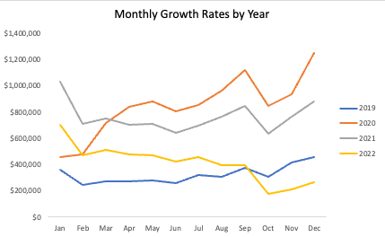
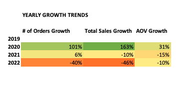
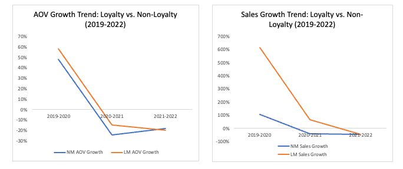
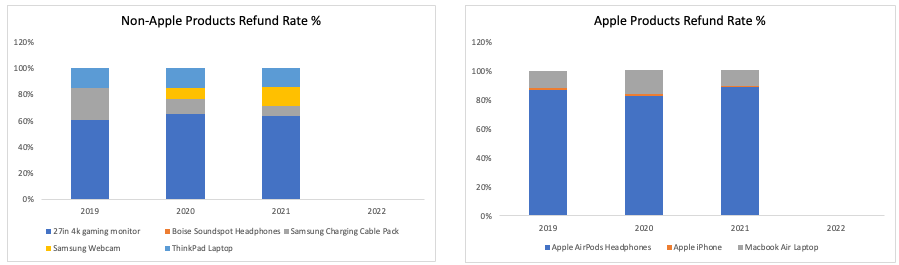
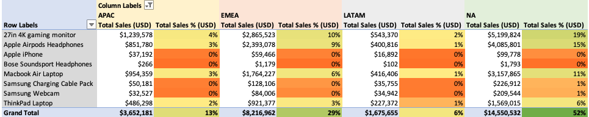

## About TechTrove

Established in 2014, TechTrove provides customers worldwide with a diverse range of reputable advanced electronics and accessories. Having accumulated extensive data on orders, customers, and geographic trends, TechTrove is poised to delve deeply into this information to uncover valuable insights. These insights will be essential for identifying areas for improvement and formulating actionable strategies to ensure consistent growth in the competitive eCommerce landscape.

### Digest of Discoveries

An analysis spanning from 2019 to 2022 revealed significant sales growth, surpassing $28 million USD. In 2020, the average order value reached $300, marking a Total Sales Growth of 163% from 2019 to 2020, largely influenced by the COVID-19 Pandemic, which prompted customers to stay and work from home. However, there was a slight decline in the total number of orders in 2021, followed by a notable 46% decrease in 2022. It is imperative for TechTrove to investigate the reasons behind these declines and strategize on maintaining the sales momentum observed from 2019 to 2021. The report below will outline a data-backed analysis and actionable recommendations for TechTrove to successfully navigate forward. Please click [here](TechTrove_ERD.png) to view the entity relationship diagram. 

## Insights Gleaned

### Yearly and Monthly Trends

  
  

As observable above, trends from 2019 to 2022 in TechTrove's ecommerce operations reveal fascinating insights in sales dynamics. Overall, TechTrove made a total of over 28M in revenue. During this time there were noticeable peaks in purchases, particularly evident during the holiday season (averaging 21%), juxtaposed with consistent troughs in growth rates during October (averaging -31%) and February(averaging -23%).

The annual analysis from 2019 to 2020 uncovers a remarkable surge in key metrics such as the number of orders, total sales, and average order value, including a notable 101% increase in orders. This surge can be attributed to the significant change in consumer behavior triggered by the emergence of the COVID-19 pandemic, prompting more consumers to turn to online purchases for remote work necessities. For instance, in March of 2020, there was a 46% spike in the number of orders. Conversely, October 2022 saw a stark decline of 47%, reflecting the intricate dynamics of the market.

The intriguing patterns in average order value (AOV), including instances of negative AOV despite increases in orders and total sales, pose unique challenges. For instance, in March 2021, despite a negative AOV growth rate of -6%, there was a 29% increase in the number of orders, suggesting that customers were purchasing more items at lower costs. 
Navigating these complexities is crucial for TechTrove to sustain growth and customer satisfaction, as this comprehensive analysis provides invaluable insights into sales performance metrics over time. Leveraging these insights to identify peak sales months and adapt strategies accordingly allows TechTrove to optimize operations and ensure continued success in the ever-evolving ecommerce landscape.
### Loyalty Member Program

  

TechTrove's sales growth data indicates that loyalty members consistently outpaced non-loyalty members in terms of purchasing behavior. Between 2019 and 2020, sales among loyalty members surged by 614%, attributed largely to Covid-19, while non-loyalty members saw a growth rate of 108%. Subsequently, loyalty members continued to exhibit growth, with a substantial 64% increase between 2020 and 2021 and a 44% decrease by 2022, whereas non-loyalty members experienced drops ranging from 40-50% in subsequent years. The substantial increase in sales among loyalty members in 2020, despite fluctuations in growth rates in ensuing years, suggests their higher engagement and reliance on the loyalty program. Additionally, loyalty members maintained higher AOVs compared to non-members, indicating a tendency to purchase more expensive items. Moreover, while loyalty members saw a significant increase in the total number of orders in 2020, indicating frequent purchases, non-loyalty members experienced a rapid increase followed by declines, suggesting a decline in engagement or retention. Overall, these findings underscore the effectiveness of TechTrove's loyalty program in driving higher sales and engagement among its members.

### Refunds Recap

  

Distinct trends emerge concerninng refund rates for Apple and non-Apple product lines. 2020 saw a hgiher overall return rate of 8% compared 2019 (5%) and 2021 (3%). Within the non-Apple category, the ThinkPad laptop had a 17% refund rate in 2019 and 2020, dropping to 9% in 2021. Similarly, the 27-inch gaming monitor followed with significant return rates. No refudns were reported across all products in 2022. These trends suggest that factors such as product pricing, quality issues, or evolving consumer preferences may influence return rates.

Airpod headphones consistently accounted for over 80% of all Apple items refunded between 2019 and 2021, indicating potential concerns related to quality control or user expectations that TechTrove should address. Conversly, iPhones maintained a steady 1% return rate across these years, underscoring their consistent quality and high user satisfaction.
For non-Apple produts, the 27-inch gaming monitor accounted for over 60% of all returns for non-Apple products. Again, this high percentage should immediately prompt a need for TechTrove to investigate factors such as product quality or shifts in consumer preferences that might influence return rates. 

### Regional Patterns

  

In terms of regional sales distribution, North America (NA) leads with a 52% market share, underscoring its pivotal role in TechTrove's consumer base and market strategy. The European, Middle Eastern, and African region (EMEA) follows with 29% of total sales, indicating significant shopping activity in these areas. Asia-Pacific (APAC) and Latin America (LATAM) contribute 13% and 6% respectively, suggesting opportunities for growth in these markets where TechTrove's market share is comparatively lower.

There was minimal profit margins ranging from 0% to 0.01% for Bose Soundsport headphones across all regionsregions. The 27-inch gaming monitor emerged as the top-selling product globally, closely followed by the MacBook Air, highlighting a preference for gaming-related items. This trend reflects the widespread popularity of gaming globally, while the relatively lower demand for Apple products outside the US also contributes to these sales patterns.

Understanding these regional preferences and market dynamics will enable TechTrove to tailor its marketing strategies and product offerings effectively, maximizing sales potential in each segment. Exploring growth opportunities in APAC and LATAM through targeted marketing and product development aligned with emerging trends will be crucial for expanding market share in these regions.

## Actionable Items and Recommendations 

TechTrove faces unique challenges and opportunities revealed by its AOV fluctuations and the effectiveness of its loyalty program. Despite occasional negative AOV growth, such as the -6% rate in March 2021 alongside increased orders, TechTrove can optimize pricing strategies to maximize revenue per transaction while maintaining customer satisfaction. Enhancing the loyalty program's effectiveness through personalized rewards and exclusive incentives based on customer behavior will foster greater engagement and repeat purchases. Addressing high return rates, especially in specific product categories, requires TechTrove to investigate factors like product quality issues or shifts in consumer preferences. Tailoring marketing strategies to regional preferences and market dynamics, particularly in the Asian Pacific and Latin America, presents growth opportunities through localized campaigns and product offerings. By implementing these strategies, TechTrove can navigate challenges effectively, capitalize on opportunities for expansion, and maintain a competitive edge in the dynamic ecommerce landscape.

