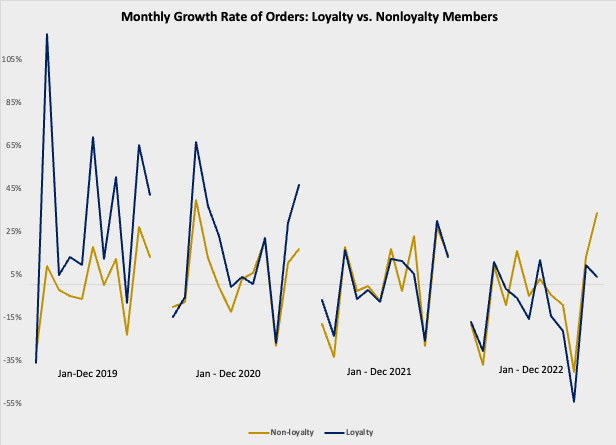
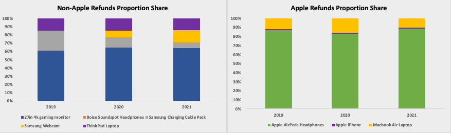
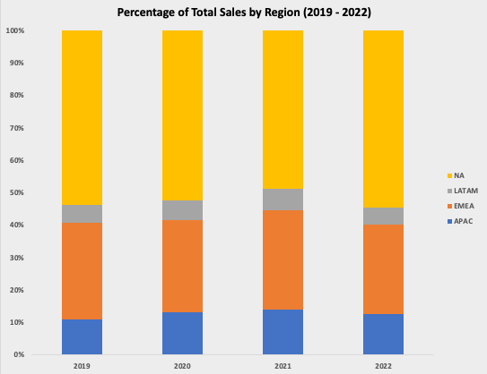

## Overview of TechTrove
Founded in 2014, TechTrove offers customers globally a wide array of high-quality advanced electronics and accessories. With extensive data on orders, customers, and geographic trends, TechTrove is well-positioned to explore this information deeply, uncovering valuable insights. These insights are crucial for pinpointing areas of improvement and developing actionable strategies to drive continuous growth in the competitive e-commerce environment.

### Digest of Discoveries

  

From 2019 to 2022, TechTrove experienced significant sales growth, surpassing $28 million USD. In 2020, the average order value (AOV) peaked at $300, marking a 163% total sales growth from 2019 to 2020, largely influenced by the COVID-19 pandemic which prompted customers to work and stay at home. However, there was a 10% decline in total orders in 2021 followed by a notable 46% drop in 2022. It is crucial for TechTrove to investigate the reasons behind these declines and strategize to maintain the sales momentum observed from 2019 to 2021. The following report presents a data-driven analysis and actionable recommendations for TechTrove to navigate successfully forward. Click [here](images/TechTrove_ERD.png) to view the entity relationship diagram.

## Insights Gleaned

### Yearly and Monthly Trends

  
  

Certainly! Here’s a revised version that incorporates bullet points within the narrative framework:

TechTrove's ecommerce journey from 2019 to 2022 reveals a dynamic landscape shaped by evolving consumer behaviors and market fluctuations. During this period, the company experienced peaks and valleys:

**Sales Trends:**
- Purchases peaked notably during holiday seasons, averaging a 21% increase.
- Growth rates dipped consistently in October (averaging -31%) and February (averaging -23%), reflecting seasonal fluctuations in consumer behavior.

**Impact of COVID-19 (2019-2020):**
- Orders surged by 101%, demonstrating rapid adjustments in consumer spending.
- March 2020 saw a remarkable 46% spike in orders as customers adapted to new norms.

**Market Fluctuations:**
- October 2022 experienced a sharp 47% decline in orders, highlighting the sector's inherent volatility.
- Despite increased orders and total sales, TechTrove faced instances of negative Average Order Value (AOV) growth, such as a -6% change observed in March 2021.

**Strategic Insights:**
- Insights from this analysis help TechTrove identify peak sales periods and adapt strategies to resonate with evolving consumer preferences and market dynamics.
- Navigating these complexities is crucial for sustaining growth and enhancing customer satisfaction.

TechTrove's journey underscores the importance of agility and strategic foresight in the dynamic ecommerce landscape, where adapting to fluctuating consumer behaviors and market conditions is key to long-term success.

### Analysis of Loyalty Member Program

  

A comparison of monthly order count growth rates between loyalty and non-loyalty customers from 2019-2022 shows notable differences in their purchasing trends.

**Non-loyalty customers:**

- Displayed fluctuating growth rates over the period.
- Experienced significant swings, such as a decline of -40% in October 2022.
- Had occasional peaks, such as a 39% increase in March 2020.

**Loyalty customers:**

- Consistently demonstrated steadier growth.
- Highlighted by positive percentages like 117% in March 2019 and 66% in March 2020, which stood out amidst varying trends.

This comparison underscores the effectiveness of TechTrove's loyalty programs in maintaining consistent customer engagement and fostering growth, despite occasional downturns observed across both customer segments. By focusing on sustaining and enhancing loyalty initiatives, TechTrove can mitigate the volatility seen among non-loyalty customers, strengthen customer retention efforts, and optimize overall business performance in the competitive ecommerce environment.

### Recap of Refunds and Returns

  

In analyzing refund rates across different product categories between 2019 and 2022, TechTrove observes notable trends that shed light on customer behavior. 

**General Trends:**
- Items at higher price points, such as the MacBook Air (17%) and ThinkPad (16%), consistently exhibit higher maximum refund rates.
- Products priced under $100 maintain refund rates consistently below 5% throughout the period, suggesting higher customer commitment despite the higher potential for returns.

The Apple iPhonem known for its seasonal updates, displays significant variability in refund rates:

**Apple iPhone Refund Rates**

- In 2019 there was a 14% refund rate, no returns were recorded in June and July, and then in August there was an 18% spike
- In 2019 there were 5 iPhones returned, in 2020 13 were returned, and in 2021 4 were returned

Notably, 2022 marks a year without any recorded refunds across all product categories, prompting TechTrove to investigate this anomaly further.  These insights underscore the complexity of customer purchasing decisions and the nuances in refund behaviors across different product lines. By understanding these trends, TechTrove can better strategize its inventory management, customer service initiatives, and product development efforts to optimize overall customer satisfaction and business performance in the competitive market landscape.

  

**Refunded Apple Products (2019-2021):**

- AirPod headphones consistently represented over 80% of all refunded Apple items.
- iPhones maintained a steady 1% refund rate during this period, indicating consistent quality and high customer satisfaction.
- This highlights a significant share of refunds within TechTrove's Apple product line, raising concerns about potential issues related to quality control or customer expectations that TechTrove should investigate.

**Refunded Non-Apple Products (2019-2021):** 

- The 27-inch gaming monitor accounted for over 60% of all returns in the non-Apple product line.
- This suggests a notable refund share within TechTrove's non-Apple product offerings.
- The observation underscores the need for TechTrove to explore factors such as product quality or evolving consumer preferences that could impact return rates across its entire product range.

These insights emphasize the varying refund dynamics between Apple and non-Apple products within TechTrove's inventory, prompting strategic considerations for improving product quality, managing customer expectations, and enhancing overall customer satisfaction.

### Identification of Regional Patterns

  

North America (NA) stands out in regional sales distribution, achieving a peak total sales of 5.3 million in 2020, underscoring its pivotal role in TechTrove's consumer base and strategic focus. Following closely, the European, Middle Eastern, and African region (EMEA) also achieved significant sales of 2.9 million in 2020, highlighting robust shopping activity in these regions. In contrast, Asia-Pacific (APAC) and Latin America (LATAM) collectively accounted for less than 50% of the market share from 2019 to 2022, indicating promising growth prospects for TechTrove in these burgeoning markets.

Understanding these regional preferences and market dynamics will empower TechTrove to adeptly tailor its marketing strategies and product offerings. Capitalizing on targeted marketing and aligning product development with emerging trends will be crucial to seizing opportunities and expanding market share in APAC and LATAM.

## Proposed Improvements and Recommendations 

TechTrove faces unique challenges and opportunities reflected in its AOV fluctuations and the effectiveness of its loyalty program. Despite occasional negative AOV growth, TechTrove can optimize pricing strategies to maximize revenue per transaction while ensuring customer satisfaction. Enhancing the loyalty program with personalized rewards and exclusive incentives based on customer behavior will promote greater engagement and repeat purchases.

Although some product categories, like the recently added Bose Soundsport Headphones, accounted for less than 0.1% of revenue over four years, their potential should be evaluated before making any discontinuation decisions. Addressing high return rates in other key categories is also essential by investigating factors such as product quality issues or shifts in consumer preferences. Tailoring marketing strategies to regional preferences and dynamics, especially in Asia-Pacific and Latin America, presents growth opportunities through localized campaigns and product offerings.

TechTrove's overarching goal is to achieve a total of $30 million in increased total sales by January 2027. Implementing these strategies will enable TechTrove to effectively navigate challenges, capitalize on expansion opportunities, and maintain a competitive edge in the dynamic e-commerce landscape.

